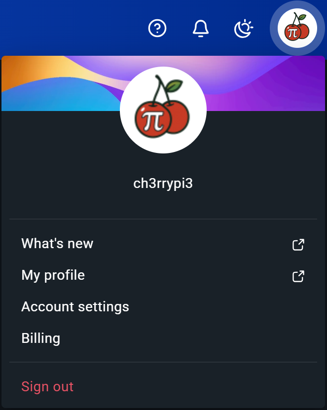
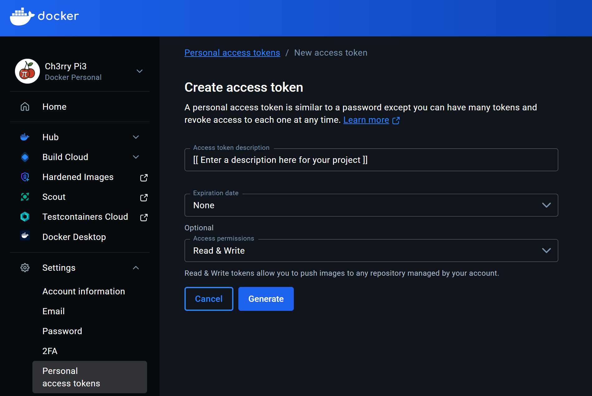
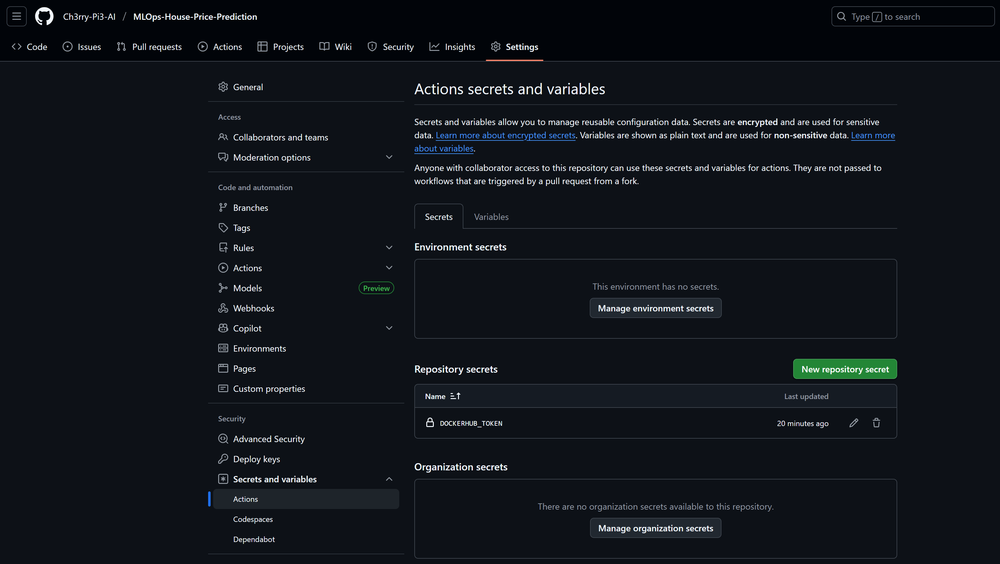

Perfect — since this branch represents your **CI/CD automation stage**, we’ll make the new `README.md` reflect that progression in your project lifecycle.

This version maintains the same visual and structural style as your earlier READMEs (e.g., Streamlit one), reuses your four `.png` files for illustration, but adapts the narrative for **Continuous Integration and DockerHub publishing**.

Here’s the full, polished replacement:

---

# **Continuous Integration (CI) — Automation Stage**

This branch extends the **MLOps House Price Prediction** project by introducing a fully automated **Continuous Integration (CI)** pipeline using **GitHub Actions**.
The pipeline tests, processes, trains, and publishes your model as a **Docker image** directly to **DockerHub** — ensuring every change to your repository is automatically validated and built in a reproducible way.

This stage connects your entire project into a cohesive, version-controlled MLOps workflow that integrates **testing**, **model retraining**, and **container publishing**.

## **Module Structure**

```
mlops-house-price-prediction/
├── .github/
│   ├── workflows/
│   │   └── ci.yml                 # UPDATED! - CI pipeline definition (test → process → train → publish)
│   └── img/                       # Supporting setup visuals
│       ├── dockerhub_username.png
│       ├── dockerhub_token.png
│       ├── github_secrets.png
│       └── github_new_secret.png
├── src/                           # Source modules for data, features, and models
├── streamlit_app/                 # Streamlit UI for user inference
├── Dockerfile                     # FastAPI inference container
├── docker-compose.yaml            # Combined inference orchestration
└── README.md
```

## **Pipeline Overview**

The **CI workflow** (`ci.yml`) is triggered automatically on every **push** or **pull request**. It executes the following jobs in sequence:

| Stage                             | Description                                                                                            |
| --------------------------------- | ------------------------------------------------------------------------------------------------------ |
| 🧪 **Tests**                      | Runs all unit tests using `pytest` inside a `uv` virtual environment.                                  |
| 🧹 **Data Processing & Features** | Loads raw CSV data, cleans it, and engineers new features using `invoke`.                              |
| 🧠 **Model Training**             | Trains the ML model and logs it to a temporary **MLflow server** running inside Docker.                |
| 🏗️ **Build & Publish**           | Builds the final **Docker image** and pushes it to your **DockerHub** repository on the `main` branch. |

This ensures every branch is validated before merging, and the main branch always holds a **ready-to-deploy** model image.

---

## **1️⃣ Setting Up DockerHub Credentials**

To allow GitHub Actions to publish your Docker image, you’ll need your **DockerHub username** and a **personal access token**.

### 🪪 Step 1 — Get Your Username

1. Log in to [DockerHub](https://hub.docker.com/).
2. Click your **profile icon** (top right).
3. Your username is displayed directly under your profile picture.

<p align="center">
  
</p>

For example, here the username is **`ch3rrypi3`**.

---

### 🔐 Step 2 — Generate a Personal Access Token

1. Click your **profile icon** again.
2. Go to **Account settings → Personal access tokens.**
3. Click **Generate new token.**

<p align="center">
  
</p>

> ⚠️ **Important:** Copy the token immediately — you will not be able to view it again later.
> You’ll use this as the **Secret value** in GitHub in the next step.

---

## **2️⃣ Configuring GitHub Secrets and Variables**

Now we’ll connect DockerHub with GitHub Actions so the pipeline can push images automatically.

### ⚙️ Step 1 — Open Your Repository Settings

1. In your GitHub repository, click the **Settings** tab.
2. Under **Security**, expand **Secrets and variables → Actions.**

<p align="center">
  
</p>

---

### 🔑 Step 2 — Add a Repository Secret

1. Under the **Secrets** tab, click **New repository secret.**
2. For **Name**, enter:

   ```
   DOCKERHUB_TOKEN
   ```
3. In **Secret**, paste your DockerHub access token.
4. Click **Add secret.**

<p align="center">
  
</p>

---

### 🧩 Step 3 — Add a Repository Variable

1. Switch to the **Variables** tab.
2. Click **New repository variable.**
3. For **Name**, enter:

   ```
   DOCKERHUB_USERNAME
   ```
4. For **Value**, enter your DockerHub username (e.g., `ch3rrypi3`).
5. Click **Add variable.**

> The pipeline will now use these to authenticate when publishing your model image.

---

## **3️⃣ Running the CI Workflow**

Once your credentials are configured, you can trigger the pipeline automatically.

### 🧪 Option A — Test on a feature branch (no Docker push)

Push to a non-main branch to test your workflow up to model training:

```bash
git add .
git commit -m "Run CI pipeline test"
git push origin feature/ci-update
```

This will run:

* ✅ `tests`
* 🧹 `data-processing`
* 🧠 `model-training`

…but **skip** the Docker publish step.

---

### 🚀 Option B — Publish via the `main` branch

When you **merge** into `main`, or push directly to it from VS Code:

```bash
git push origin main
```

This will run **all** stages, including:

* Building the final Docker image
* Logging in to DockerHub
* Pushing the image:

  ```
  docker.io/<your_username>/house-price-model:latest
  ```

You’ll then see it appear in your DockerHub repository.

---

## **4️⃣ Verifying Your Docker Image**

After the pipeline completes successfully, go to:

👉 [https://hub.docker.com/repositories/ch3rrypi3](https://hub.docker.com/repositories/ch3rrypi3)

Your latest image should be visible under **Repositories** as:

```
house-price-model:latest
```

You can also verify locally:

```bash
docker pull ch3rrypi3/house-price-model:latest
docker images | grep house-price-model
```

---

## **✅ Summary**

This **CI Stage** introduces full automation for your **MLOps House Price Prediction** project.

**Key outcomes:**

* Seamless **Continuous Integration** workflow using **GitHub Actions**
* End-to-end pipeline: **test → process → train → publish**
* Secure **DockerHub authentication** via repository secrets and variables
* Reproducible **Docker image publishing** with every merge to main
* Visual setup guide (DockerHub + GitHub Secrets)

Once configured, every push or merge will trigger your workflow automatically — ensuring reproducible, **continuous integration** of your **House Price Prediction** model. 🚀

---

Would you like me to include a small table summarising the four images at the top (like a visual reference index) — e.g., “Image | Description | Used In Section”? It can make the README even more polished.
