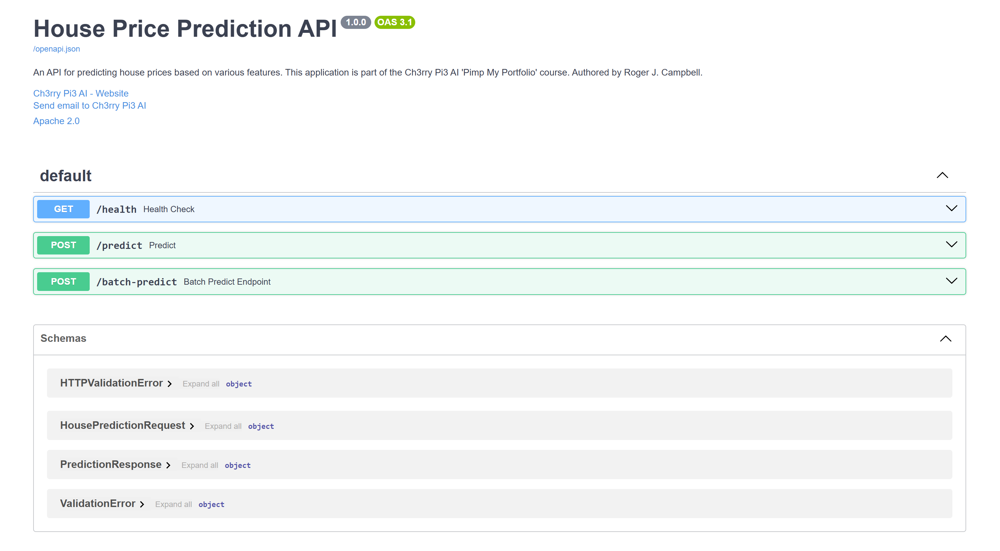

# **API Module — House Price Prediction (Inference Stage)**

This folder contains the **FastAPI inference service** responsible for real-time and batch predictions in the **MLOps House Price Prediction** project.
It loads the trained estimator and preprocessor, validates incoming data with **Pydantic**, performs **model inference**, and returns structured JSON responses — including a simple ±10% confidence band.

The API module forms the backend of the **inference stack**, complementing the **Streamlit frontend** for user interaction. Together, these services transform the trained model into a production-ready prediction interface.


## **Design Overview**

The design follows **single-responsibility principles** for clarity and maintainability:

* `schemas.py` → Pydantic request and response models
* `inference.py` → model and preprocessor loading, single and batch prediction logic
* `main.py` → FastAPI app setup, routing, CORS configuration, and OpenAPI documentation
* `requirements.txt` → runtime dependencies for the inference layer

This architecture ensures that the API remains **modular, testable, and easily portable** — whether running locally, in Docker, or through a CI/CD environment.


## **Module Structure**

```
src/api/
├── schemas.py         # Pydantic models (request & response)
├── inference.py       # Loads model/preprocessor and performs inference
├── main.py            # FastAPI app with /health, /predict, /batch-predict
├── requirements.txt   # Inference service dependencies
└── img/
    └── fastapi_backend.png   # Swagger UI view of /docs
```

**Expected Model Artefacts:**

```
models/trained/
├── house_price_model.pkl
└── preprocessor.pkl
```


## **Endpoints**

### 1️⃣ `GET /health`

Health check endpoint confirming that the API and model are live.

**Response:**

```json
{ "status": "healthy", "model_loaded": true }
```


### 2️⃣ `POST /predict`

Predicts the price for a single house.

**Request** (`HousePredictionRequest`):

```json
{
  "sqft": 1800.0,
  "bedrooms": 3,
  "bathrooms": 2.0,
  "location": "suburban",
  "year_built": 2005,
  "condition": "Good"
}
```

**Response** (`PredictionResponse`):

```json
{
  "predicted_price": 352000.75,
  "confidence_interval": [316800.68, 387200.83],
  "features_importance": {"sqft": 0.42, "bedrooms": 0.25, "bathrooms": 0.18},
  "prediction_time": "2025-10-03T18:30:12.345678"
}
```


### 3️⃣ `POST /batch-predict`

Generates predictions for multiple records in a single request.

**Request** (`List[HousePredictionRequest]`):

```json
[
  { "sqft": 1200, "bedrooms": 2, "bathrooms": 1.0, "location": "urban", "year_built": 1998, "condition": "Fair" },
  { "sqft": 2400, "bedrooms": 4, "bathrooms": 3.0, "location": "rural", "year_built": 2012, "condition": "Excellent" }
]
```

**Response** (`List[float]`):

```json
[245000.0, 421300.5]
```


## **Swagger /docs Interface**

The FastAPI service automatically generates a **Swagger UI** at [`/docs`](http://127.0.0.1:8000/docs), where you can explore and test all available endpoints interactively.

<p align="center">
  
</p>


## **Request / Response Schemas (Summary)**

### 🧾 `HousePredictionRequest`

| Field        | Type              | Description                              |
|  | -- | - |
| `sqft`       | `float (>0)`      | Property area in square feet             |
| `bedrooms`   | `int (>=1)`       | Number of bedrooms                       |
| `bathrooms`  | `float (>0)`      | Number of bathrooms                      |
| `location`   | `str`             | e.g., `"urban"`, `"suburban"`, `"rural"` |
| `year_built` | `int (1800–2023)` | Construction year                        |
| `condition`  | `str`             | e.g., `"Good"`, `"Excellent"`, `"Fair"`  |

### 📦 `PredictionResponse`

| Field                 | Type               | Description                         |
|  |  | -- |
| `predicted_price`     | `float`            | Predicted house price               |
| `confidence_interval` | `List[float]`      | Lower and upper bounds              |
| `features_importance` | `Dict[str, float]` | Relative importance of top features |
| `prediction_time`     | `str`              | ISO-8601 UTC timestamp              |


## **Running the Inference API**

> Ensure your trained artefacts are available at
> `models/trained/house_price_model.pkl` and `models/trained/preprocessor.pkl`.

### 🧪 Option A — Run with `uv`

```bash
# From project root
uv pip install -r src/api/requirements.txt
uv run uvicorn src.api.main:app --reload
```

Open your browser at:

* [http://127.0.0.1:8000/docs](http://127.0.0.1:8000/docs) → interactive Swagger UI
* [http://127.0.0.1:8000/health](http://127.0.0.1:8000/health) → simple health check

### 🧰 Option B — Run with plain `pip`

```bash
pip install -r src/api/requirements.txt
uvicorn src.api.main:app --reload
```


## **Quick Usage Examples**

### 💻 cURL

```bash
curl -X POST http://127.0.0.1:8000/predict \
  -H "Content-Type: application/json" \
  -d '{"sqft":1800,"bedrooms":3,"bathrooms":2.0,"location":"suburban","year_built":2005,"condition":"Good"}'
```

### ⚙️ HTTPie

```bash
http POST :8000/predict sqft:=1800 bedrooms:=3 bathrooms:=2.0 location=suburban year_built:=2005 condition=Good
```

### 🐍 Python client

```python
import requests

payload = {
    "sqft": 1800,
    "bedrooms": 3,
    "bathrooms": 2.0,
    "location": "suburban",
    "year_built": 2005,
    "condition": "Good",
}
r = requests.post("http://127.0.0.1:8000/predict", json=payload, timeout=10)
print(r.json())
```


## **Configuration & Environment**

Model paths are defined in `src/api/inference.py`:

```python
MODEL_PATH = "models/trained/house_price_model.pkl"
PREPROCESSOR_PATH = "models/trained/preprocessor.pkl"
```

If you run inference in a container or cloud environment, consider replacing hardcoded paths with environment variables or mounted volumes.


## **CORS Configuration**

`main.py` currently allows all origins for development:

```python
app.add_middleware(
    CORSMiddleware,
    allow_origins=["*"], allow_credentials=True,
    allow_methods=["*"], allow_headers=["*"],
)
```

For production, restrict allowed origins (e.g. `["https://yourdomain.com"]`).


## **Extending the Inference Service**

* **Confidence Intervals:** Replace static ±10% with data-driven intervals (quantile regression, conformal prediction, etc.)
* **Explainability:** Populate `features_importance` dynamically (e.g., SHAP or feature importances)
* **Batch Processing:** Integrate async queueing (Celery, RQ) for heavy inference loads
* **Validation:** Enforce categorical vocabularies matching the preprocessor expectations


## ✅ **Summary**

This module implements a **robust, production-ready inference layer** using FastAPI:

* Clean architecture with modular components
* Reproducible predictions aligned with the training pipeline
* Interactive Swagger documentation via `/docs`
* Configurable runtime suitable for local, containerised, or cloud inference

It powers the backend of the **Streamlit house price predictor**, completing the end-to-end inference workflow. 🚀
