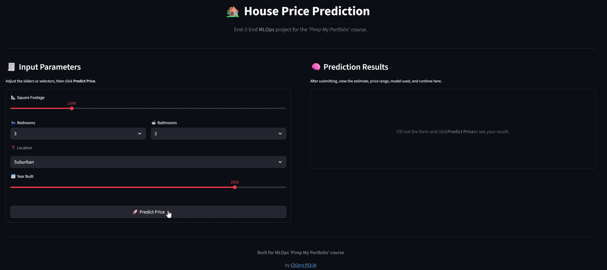

# **Model Inference Stage**

This branch extends the **MLOps House Price Prediction** project by implementing the **model inference pipeline**.
It introduces a production-ready inference stack composed of:

* **FastAPI** – serves predictions from the trained model.
* **Streamlit** – provides an intuitive web interface for real-time user interaction.
* **Docker & Docker Compose** – containerise and orchestrate both services for seamless execution.

This stage operationalises the trained model and preprocessor into a **live, queryable inference service** with an accompanying UI for end-users.


## **Project Structure**

```
mlops-house-price-prediction/
├── .venv/
├── .github/
├── data/
├── models/
├── notebooks/
├── src/
│   ├── api/                                # 🧠 FastAPI inference service
│   │   ├── inference.py                    #   Loads model + preprocessor, defines predict()
│   │   ├── main.py                         #   FastAPI entrypoint and routing
│   │   ├── schemas.py                      #   Pydantic request/response models
│   │   └── requirements.txt                #   FastAPI + Uvicorn dependencies
│   ├── data/
├── streamlit_app/                          # 🎨 Streamlit user interface
│   ├── app.py                              #   Web UI calling the FastAPI backend
│   ├── requirements.txt                    #   Streamlit + Requests dependencies
│   └── Dockerfile                          #   Streamlit container definition
├── img/                                    # 🖼️ Media assets (GIFs, screenshots, etc.)
│   └── streamlit_app.gif                   #   Demonstration of the inference app
├── Dockerfile                              # FastAPI container definition
├── docker-compose.yaml                     # Multi-service orchestration (FastAPI + Streamlit)
├── tasks.py
├── README.md
└── uv.lock
```

> Note: Any `.venv/` directory remains ignored and should not be committed.


## **Inference Overview**

### 🧠 `src/api/` — FastAPI Inference Service

* Loads the trained model (`house_price_model.pkl`) and preprocessor.
* Exposes two endpoints:

  * **`/health`** — health check to confirm the API is live.
  * **`/predict`** — accepts JSON input conforming to `HousePredictionRequest` and returns the predicted house price.
* Runs via **Uvicorn** on port `8000` inside its container.


### 🎨 `streamlit_app/` — Streamlit Frontend

* Provides an interactive web interface for inputting house attributes.
* Sends requests to the FastAPI backend using the `API_URL` environment variable (e.g., `http://fastapi:8000`).
* Displays:

  * Predicted price
  * Model used
  * Top three most influential factors
  * Prediction latency (in milliseconds)
* Runs via **Streamlit** on port `8501` inside its container.

<p align="center">
  
</p>


## **Containerisation & Orchestration**

### 🧩 Dockerfiles

* **Root `Dockerfile`** → builds the FastAPI inference service.
* **`streamlit_app/Dockerfile`** → builds the Streamlit interface.

### ⚙️ `docker-compose.yaml`

Defines and links both services:

```yaml
services:
  fastapi:
    build: .
    ports: ["8000:8000"]

  streamlit:
    build: ./streamlit_app
    ports: ["8501:8501"]
    environment:
      API_URL: http://fastapi:8000
    depends_on:
      - fastapi
```

Docker Compose automatically networks the two containers, so the Streamlit frontend communicates with the FastAPI backend via the hostname `fastapi`.


## **Building and Running the Inference Stack**

### 🏗️ Build both images

```bash
docker compose build
```

### 🚀 Launch the stack

```bash
docker compose up
# or detached mode:
docker compose up -d
```

### 🌐 Access the services

| Service       | URL                                                      |
| - | -- |
| **FastAPI**   | [http://localhost:8000/docs](http://localhost:8000/docs) |
| **Streamlit** | [http://localhost:8501](http://localhost:8501)           |


## **Testing the FastAPI Endpoint**

### ✅ Health Check

```bash
curl http://localhost:8000/health
```

### 🧠 Example Prediction Request

```bash
curl -X POST "http://localhost:8000/predict" \
     -H "Content-Type: application/json" \
     -d '{"sqft":2000,"bedrooms":3,"bathrooms":2,"year_built":2010,"condition":"Good"}'
```

Expected response:

```json
{"predicted_price": 354820.45, "currency": "USD"}
```


## **Publishing to Docker Hub**

### 1️⃣ Log in

```bash
docker login
# username: ch3rrypi3
```

### 2️⃣ Push the images

```bash
docker push ch3rrypi3/fastapi:inference
docker push ch3rrypi3/streamlit:inference
```

### 3️⃣ Verify upload

Check your repositories at
👉 [https://hub.docker.com/repositories/ch3rrypi3](https://hub.docker.com/repositories/ch3rrypi3)


## **Useful Docker Commands**

| Purpose                                 | Command                                         |
|  | -- |
| List running containers                 | `docker ps`                                     |
| List all containers (including stopped) | `docker ps -a`                                  |
| Stop containers                         | `docker compose down`                           |
| Remove all containers, images, networks | `docker system prune -a`                        |
| View image list                         | `docker images`                                 |
| Tail logs live                          | `docker compose logs -f`                        |
| Build a single image                    | `docker build -t ch3rrypi3/fastapi:inference .` |
| Push image to Docker Hub                | `docker push ch3rrypi3/fastapi:inference`       |


## ✅ Summary

This **Inference Stage** completes the MLOps House Price Prediction pipeline by providing:

* A **FastAPI** backend for real-time model inference.
* A **Streamlit** web app for interactive visualisation and prediction.
* Full **Docker and Compose** orchestration for portability and reproducibility.
* Optional **Docker Hub** publishing for versioned distribution.

With this stage, the project delivers a **fully containerised, end-to-end ML inference system** ready for local or cloud deployment. 🚀

