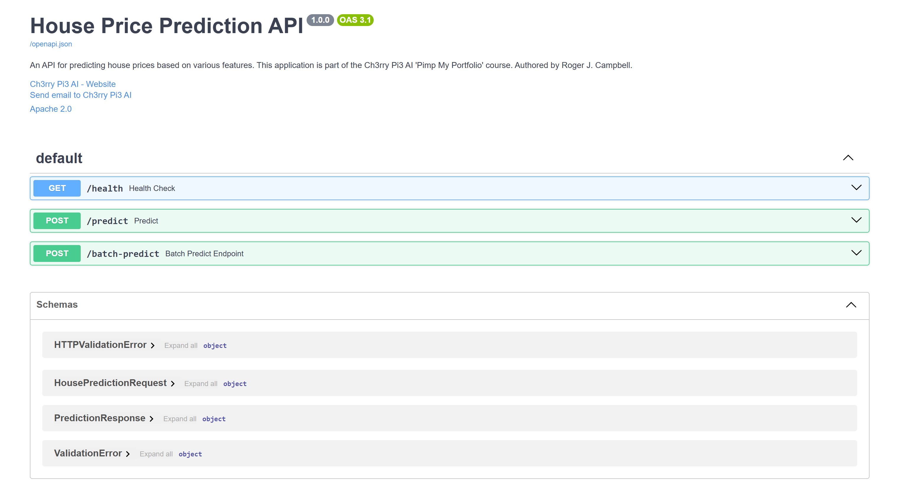

# **API Module — House Price Prediction (Inference Stage)**

This folder contains the **FastAPI inference service** responsible for serving both **real-time** and **batch predictions** in the **MLOps House Price Prediction** project.
It loads the trained estimator and preprocessor, validates incoming data via **Pydantic**, performs **inference**, and returns structured JSON responses — including a simple ±10% confidence band.

This module forms the backend of the inference system that the **Streamlit frontend** connects to.


## **Design Overview**

The API follows clear **single-responsibility principles** for maintainability and modularity:

* `schemas.py` → Pydantic request/response models
* `inference.py` → loads model/preprocessor and performs single/batch inference
* `main.py` → FastAPI entrypoint, routing, and OpenAPI documentation
* `requirements.txt` → lightweight runtime dependencies for the inference layer
* `Dockerfile` → container definition for the FastAPI service

Together, these components create a **reproducible, containerised inference service** that can be run locally, inside Docker, or as part of a CI/CD deployment.


## **Module Structure**

```
src/api/
├── schemas.py          # Pydantic models (request & response)
├── inference.py        # Loads model/preprocessor and performs inference
├── main.py             # FastAPI app with /health, /predict, /batch-predict
├── requirements.txt    # API runtime dependencies
├── Dockerfile          # Container definition for the FastAPI inference service
└── img/
    └── fastapi_backend.png   # Screenshot of /docs Swagger UI
```

**Expected Model Artefacts:**

```
models/trained/
├── house_price_model.pkl
└── preprocessor.pkl
```


## **Endpoints**

### 1️⃣ `GET /health`

Simple liveness check to verify that the API and model are running.

**Response:**

```json
{ "status": "healthy", "model_loaded": true }
```


### 2️⃣ `POST /predict`

Make a single prediction.

**Request (`HousePredictionRequest`):**

```json
{
  "sqft": 1800.0,
  "bedrooms": 3,
  "bathrooms": 2.0,
  "location": "suburban",
  "year_built": 2005,
  "condition": "Good"
}
```

**Response (`PredictionResponse`):**

```json
{
  "predicted_price": 352000.75,
  "confidence_interval": [316800.68, 387200.83],
  "features_importance": {"sqft": 0.42, "bedrooms": 0.25, "bathrooms": 0.18},
  "prediction_time": "2025-10-03T18:30:12.345678"
}
```


### 3️⃣ `POST /batch-predict`

Generate predictions for multiple properties in one request.

**Request (`List[HousePredictionRequest]`):**

```json
[
  { "sqft": 1200, "bedrooms": 2, "bathrooms": 1.0, "location": "urban", "year_built": 1998, "condition": "Fair" },
  { "sqft": 2400, "bedrooms": 4, "bathrooms": 3.0, "location": "rural", "year_built": 2012, "condition": "Excellent" }
]
```

**Response (`List[float]`):**

```json
[245000.0, 421300.5]
```


## **Swagger /docs Interface**

The FastAPI app provides an interactive documentation and testing interface at
👉 [`http://127.0.0.1:8000/docs`](http://127.0.0.1:8000/docs).

<p align="center">
  
</p>


## **Request / Response Schemas (Summary)**

### 🧾 `HousePredictionRequest`

| Field        | Type            | Description                             |
|  |  |  |
| `sqft`       | float (>0)      | Property area in square feet            |
| `bedrooms`   | int (>=1)       | Number of bedrooms                      |
| `bathrooms`  | float (>0)      | Number of bathrooms                     |
| `location`   | str             | e.g. `"urban"`, `"suburban"`, `"rural"` |
| `year_built` | int (1800–2023) | Year of construction                    |
| `condition`  | str             | e.g. `"Good"`, `"Fair"`, `"Excellent"`  |

### 📦 `PredictionResponse`

| Field                 | Type             | Description                   |
|  | - | -- |
| `predicted_price`     | float            | Model-predicted house price   |
| `confidence_interval` | List[float]      | [lower, upper] bounds of ±10% |
| `features_importance` | Dict[str, float] | Top features (optional)       |
| `prediction_time`     | str              | ISO-8601 timestamp (UTC)      |


## **Running the Inference API**

> Ensure your trained artefacts are available under `models/trained/`.

### 🧪 Option A — Run locally with `uv`

```bash
uv pip install -r src/api/requirements.txt
uv run uvicorn src.api.main:app --reload
```

Then open:

* [http://127.0.0.1:8000/docs](http://127.0.0.1:8000/docs) → interactive Swagger UI
* [http://127.0.0.1:8000/health](http://127.0.0.1:8000/health) → liveness check


### 🧰 Option B — Run locally with plain `pip`

```bash
pip install -r src/api/requirements.txt
uvicorn src.api.main:app --reload
```


## **Running via Docker**

This module includes a **Dockerfile** that defines the FastAPI inference container.

### 🏗️ Build the image

From the project root:

```bash
docker build -t house-price-fastapi -f src/api/Dockerfile src/api
```

### 🚀 Run the container

```bash
docker run -d -p 8000:8000 --name house-price-backend house-price-fastapi
```

### 🔍 Find the correct local port (if using dynamic mapping)

If you used random mapping (`-p 0:8000`) or `docker compose`, check the actual bound port:

```bash
docker ps
```

Example output:

```
CONTAINER ID   IMAGE                 PORTS
7c2a0b5c8d91   house-price-fastapi   0.0.0.0:32772->8000/tcp
```

Then open your browser at:

👉 **[http://localhost:32772/docs](http://localhost:32772/docs)**

That’s your live FastAPI inference backend interface.


## **Quick Usage**

### 💻 cURL

```bash
curl -X POST http://127.0.0.1:8000/predict \
  -H "Content-Type: application/json" \
  -d '{"sqft":1800,"bedrooms":3,"bathrooms":2.0,"location":"suburban","year_built":2005,"condition":"Good"}'
```

### ⚙️ HTTPie

```bash
http POST :8000/predict sqft:=1800 bedrooms:=3 bathrooms:=2.0 location=suburban year_built:=2005 condition=Good
```

### 🐍 Python client

```python
import requests

payload = {
    "sqft": 1800,
    "bedrooms": 3,
    "bathrooms": 2.0,
    "location": "suburban",
    "year_built": 2005,
    "condition": "Good"
}
r = requests.post("http://127.0.0.1:8000/predict", json=payload)
print(r.json())
```


## **Configuration & Environment**

Model paths are defined in `src/api/inference.py`:

```python
MODEL_PATH = "models/trained/house_price_model.pkl"
PREPROCESSOR_PATH = "models/trained/preprocessor.pkl"
```

If running in Docker or cloud environments, use environment variables or mounted volumes to point to artefact paths dynamically.


## **CORS**

CORS is enabled in `main.py` for local development:

```python
app.add_middleware(
    CORSMiddleware,
    allow_origins=["*"], allow_credentials=True,
    allow_methods=["*"], allow_headers=["*"],
)
```

For production, restrict this to known domains (e.g., `["https://yourdomain.com"]`).


## **Extending the Inference Service**

* **Confidence Intervals:** Replace fixed ±10% with model-based intervals (quantile regression, conformal prediction, etc.)
* **Explainability:** Add SHAP or feature importances dynamically
* **Batch Processing:** Introduce async queues (Celery/RQ) for high throughput
* **Validation:** Constrain categorical vocabularies for robustness


## ✅ **Summary**

This API module implements a **clean, production-ready inference backend**:

* Modular components with clear separation of concerns
* Consistent preprocessing and prediction logic with training
* Interactive **Swagger UI** for local testing
* **Dockerised** for reproducible, portable inference anywhere

Once the container is running, use `docker ps` to find your mapped local port and access
👉 **`http://localhost:<YOUR_PORT>/docs`**
to explore the live API and test real-time house price predictions. 🚀
