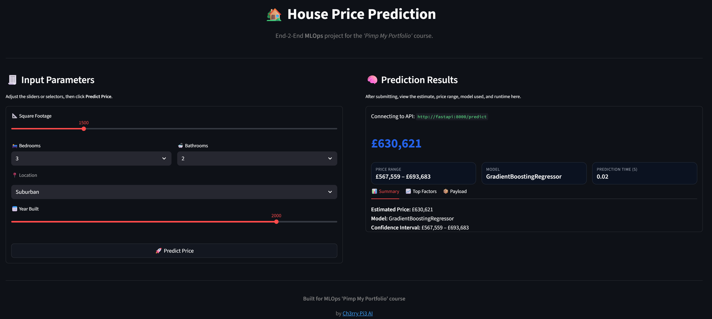

# **Streamlit App — House Price Prediction (Inference Stage)**

This folder contains the **Streamlit front-end** for the **MLOps House Price Prediction** project.
It provides an intuitive, interactive interface that allows users to generate **real-time price predictions** by communicating with the **FastAPI inference backend**.

This application demonstrates how end users can interact with the trained model seamlessly through a visual interface — without any need to access the API directly.


## **Module Structure**

```
streamlit_app/
├── app.py               # Streamlit UI for data input and model inference
├── requirements.txt     # Dependencies for Streamlit and API communication
├── Dockerfile           # Container definition for the Streamlit service
└── img/
    ├── streamlit_ui_before.png   # Before prediction
    └── streamlit_ui_after.png    # After prediction
```


## **Features**

* **Interactive input form** for:

  * Square footage (slider)
  * Bedrooms & bathrooms
  * Location (dropdown)
  * Year built (slider)
* **Prediction workflow:**

  * User inputs house features and clicks **Predict Price**
  * Request is sent to the FastAPI backend (`/predict`)
  * Response displays the predicted price, latency, and key contributing features
* **Results panel** includes:

  * 💰 **Predicted price** (formatted as currency)
  * 📈 **Top 3 most influential factors**
  * ⚙️ **Model name** and **prediction time**
  * ⏱️ **Latency** (time taken to generate the prediction)
* Built-in **fallback** logic if the backend is unreachable.
* Footer shows **hostname** and **IP address** for debugging/demo transparency.


## **User Interface Preview**

Below is the Streamlit interface before and after making a prediction:

<p align="center">
  
</p>

<p align="center">
  
</p>


## **Running the Streamlit App**

> Ensure that the **FastAPI inference backend** is running (see `src/api/README.md`) before launching the Streamlit container or local instance.

### 🧪 Option A — Run locally with `uv`

```bash
uv pip install -r streamlit_app/requirements.txt
uv run streamlit run streamlit_app/app.py
```

### 🧰 Option B — Run locally with plain `pip`

```bash
pip install -r streamlit_app/requirements.txt
streamlit run streamlit_app/app.py
```

Once running, the console will show a local URL similar to:

```
Local URL: http://localhost:8501
```

You can open this in your browser to interact with the app.


## **Running via Docker**

This module includes a `Dockerfile` for containerised deployment of the Streamlit UI.

### 🏗️ Build the image

From the project root:

```bash
docker build -t house-price-streamlit -f streamlit_app/Dockerfile streamlit_app
```

### 🚀 Run the container

```bash
docker run -d -p 8501:8501 --name house-price-ui house-price-streamlit
```

### 🔍 Find the correct port (if dynamically assigned)

If you used `docker-compose` or random port mapping (`-p 0:8501`), check the actual mapped port:

```bash
docker ps
```

Example output:

```
CONTAINER ID   IMAGE                    PORTS
f7a8c3d12b34   house-price-streamlit    0.0.0.0:32773->8501/tcp
```

In this case, open your browser to:

👉 **[http://localhost:32773](http://localhost:32773)**

That’s your live Streamlit inference interface.


## **Connecting to the API**

The Streamlit app connects to the FastAPI inference service via the environment variable `API_URL`.

By default, this is configured in **`docker-compose.yaml`** as:

```yaml
environment:
  API_URL: http://fastapi:8000
```

If running manually, you can override it:

```bash
export API_URL="http://127.0.0.1:8000"
```


## ✅ **Summary**

The **Streamlit App** completes the final user-facing component of the **House Price Prediction** pipeline.

It provides:

* A **visual, user-friendly interface** for running real-time inferences
* Seamless connectivity to the **FastAPI backend**
* **Containerisation** for reproducible deployment
* Interactive feedback with price, latency, and model explainability insights

Together with the FastAPI service, this module delivers a **complete MLOps inference workflow** — from model → API → end user. 🚀
